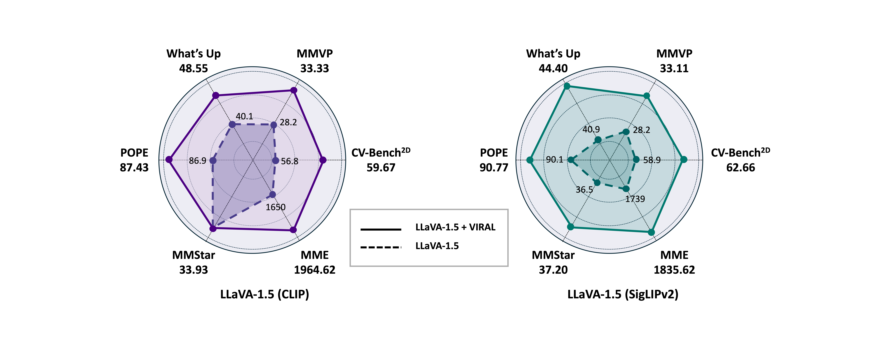

# VIRAL: VIsual Representation ALignment for MLLMs
<a href="https://arxiv.org/abs/XXXX.XXXXX"></a>
<a href="https://cvlab-kaist.github.io/VIRAL"></a>  
<br>

This is the official implementation of the paper *"Visual Representation Alignment for Multimodal Large Language Models (VIRAL)"*  

by [Heeji Yoon](https://scholar.google.com/citations?user=uZmjqNMAAAAJ&hl=en)<sup>&#42;</sup>, [Jaewoo Jung](https://crepejung00.github.io/)<sup>&#42;</sup>, [Junwan Kim](https://junwankimm.github.io/)<sup>&#42;</sup>, [Hyungyu Choi](https://hyungyu-choi.github.io/), [Heeseong Shin](https://hsshin98.github.io/), [Sangbeom Lim](https://sites.google.com/view/sangbeomlim/home), [Honggyu An](https://hg010303.github.io/), [Chaehyun Kim](https://kchyun.github.io/), [Jisang Han](https://onground-korea.github.io/), [Donghyun Kim](https://cs-people.bu.edu/donhk/), [Chanho Eom](https://pailab.cau.ac.kr/members/faculty), [Sunghwan Hong](https://sunghwanhong.github.io/), [Seungryong Kim](https://cvlab.kaist.ac.kr/members/faculty)

\*: Equal Contribution <br>  

---

## Introduction
<br>
We introduce VIRAL (VIsual Representation ALignment), a simple regularization strategy that explicitly aligns intermediate visual features in MLLMs with representations from pretrained vision encoders or stronger vision foundation models (VFMs). This alignment preserves rich spatial and semantic information, enabling MLLMs to reason more effectively over complex visual inputs.

Extensive experiments demonstrate that VIRAL consistently improves performance across standard multimodal benchmarks, highlighting the benefit of directly supervising the visual pathway. 

<br>

## 🔧 Installation
We implement **VIRAL** on top of LLaVA. To set up the environment, run:  

```bash
pip install -e .
pip install -e ".[train]"
pip install flash-attn==2.5.7 --no-build-isolation
pip install peft==0.10.0
pip install -U timm==1.0.16
pip install git+https://github.com/facebookresearch/segment-anything.git  # if using SAM
pip install opencv-python --no-deps  # if using Depth-Anything
```
This codebase was tested on Python=3.10 and CUDA=12.1 environment

## 💾 Dataset Preparation (From LLaVA)
Please download the annotation of the final mixture instruction tuning data [llava_v1_5_mix665k.json](https://huggingface.co/datasets/liuhaotian/LLaVA-Instruct-150K/blob/main/llava_v1_5_mix665k.json), and download the images from constituting datasets:

- COCO: [train2017](http://images.cocodataset.org/zips/train2017.zip)
- GQA: [images](https://downloads.cs.stanford.edu/nlp/data/gqa/images.zip)
- OCR-VQA: [download script](https://drive.google.com/drive/folders/1_GYPY5UkUy7HIcR0zq3ZCFgeZN7BAfm_?usp=sharing), **will save all files as `.jpg`**
- TextVQA: [train_val_images](https://dl.fbaipublicfiles.com/textvqa/images/train_val_images.zip)
- VisualGenome: [part1](https://cs.stanford.edu/people/rak248/VG_100K_2/images.zip), [part2](https://cs.stanford.edu/people/rak248/VG_100K_2/images2.zip)

After downloading all of them, organize the data as follows in `./playground/llava-665k`,

```
├── coco
│   └── train2017
├── gqa
│   └── images
├── ocr_vqa
│   └── images
├── textvqa
│   └── train_images
└── vg
    ├── VG_100K
    └── VG_100K_2
```

## 🔥 Training
### Run
To finetune Vicuna-1.5-7b with VIRAL, run:

```bash
bash scripts/v1_5/finetune_lora.sh
```
Make sure --config_path ./config.json is included in the bash file.

### Configuration
Example configuration of `config.json`
```bash
  "vra_loss": true,              # set false when running baseline model
  "target_layers": [16],         # nth layer outputs (1-based index, 0 denotes LLM input)
  "vra_target": "dinov2-vit-b",  # dinov2-vit-b, sam_vit_b_01ec64, clip, radio_v2.5-b, c-radio_v3-b, depth_anything_v2_vitb
  "vra_weight": 0.5,             # loss weight for VRA
  "projector_dim": 2048,         # hidden dimension of MLP projector (default: 2048)
  "z_dim": 768,                  # target VFM feature dimension
  "use_multiple_projectors": true # use separate MLPs for target layers (default: false)
```

## 🚀 Usage
For an example of how to run inference, please refer to `inference.py` script.

```
python inference.py \
  --model-path PATH/TO/MODEL \
  --image-path PATH/TO/IMAGE \
  --prompt YOUR PROMPT \
  --temperature 0.2 \
  --top_p 0.9 \
  --max-new-tokens 128
```

## ☺️ Acknowledgement
Code is implemented with extensive reference to [LLaVA](https://github.com/haotian-liu/LLaVA) and [REPA](https://github.com/sihyun-yu/REPA). We sincerely thank the original authors for their invaluable work and contributions!

## 📑 Citation
If you find this research useful, please consider citing:
```
```